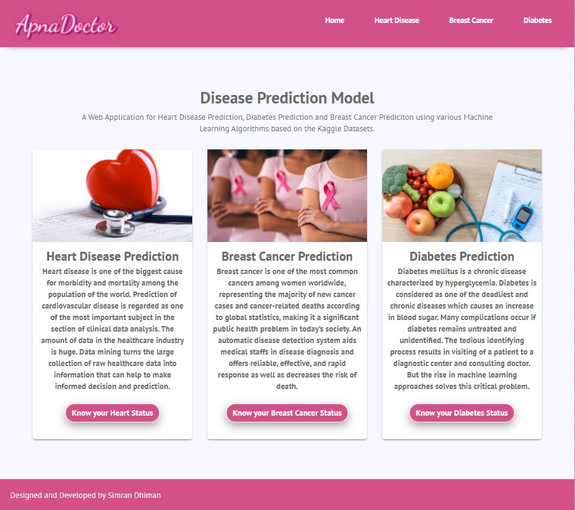
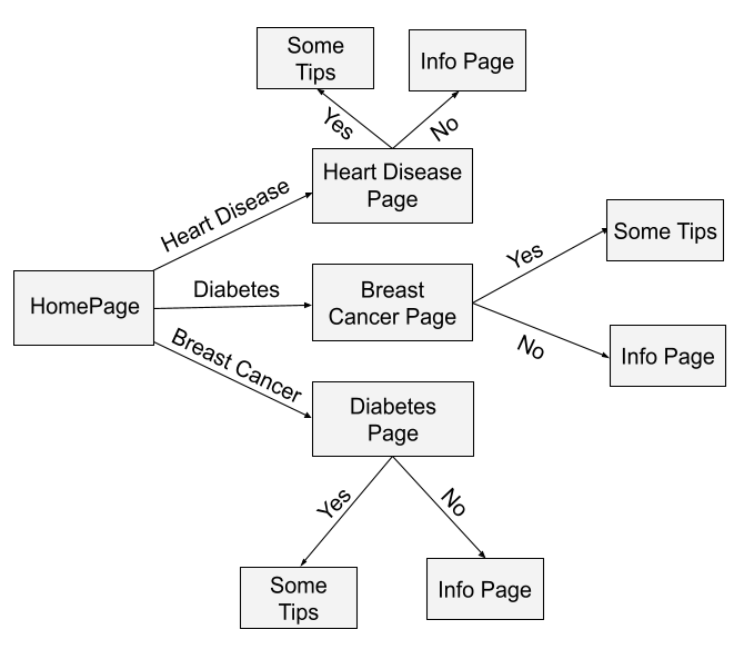

<h1 align="center">🩺ApnaDoctor🩺</h1>

# Disease Predictor Model
A Web Application for Heart Disease Prediction, Diabetes Prediction and Breast Cancer Prediction using various Machine Learning Algorithms based on the Kaggle Datasets.

## Technologies Used:
1. Python
2. Django
3. Machine Learning Algorithms (KNN and Random Forest)
4. HTML, CSS, JavaScript
5. Bootstrap
6. Kaggle Dataset

## System Design:

## Demo:
Have a look on the website being deployed on pythonanywhere.com <a href="https://simmi1234.pythonanywhere.com/">ApnaDoctor</a>
## Contributing:

Please Fork this project and send us a pull request.

## Authors:
<a href="https://simrandhiman.me/">Simran Dhiman</a>

#### If you like this project hit ⭐

Thanks for reading 🙏🏽

